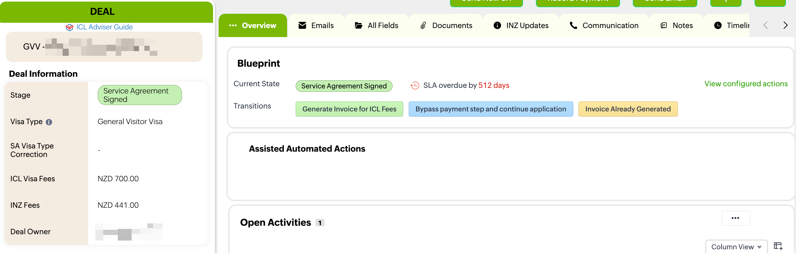
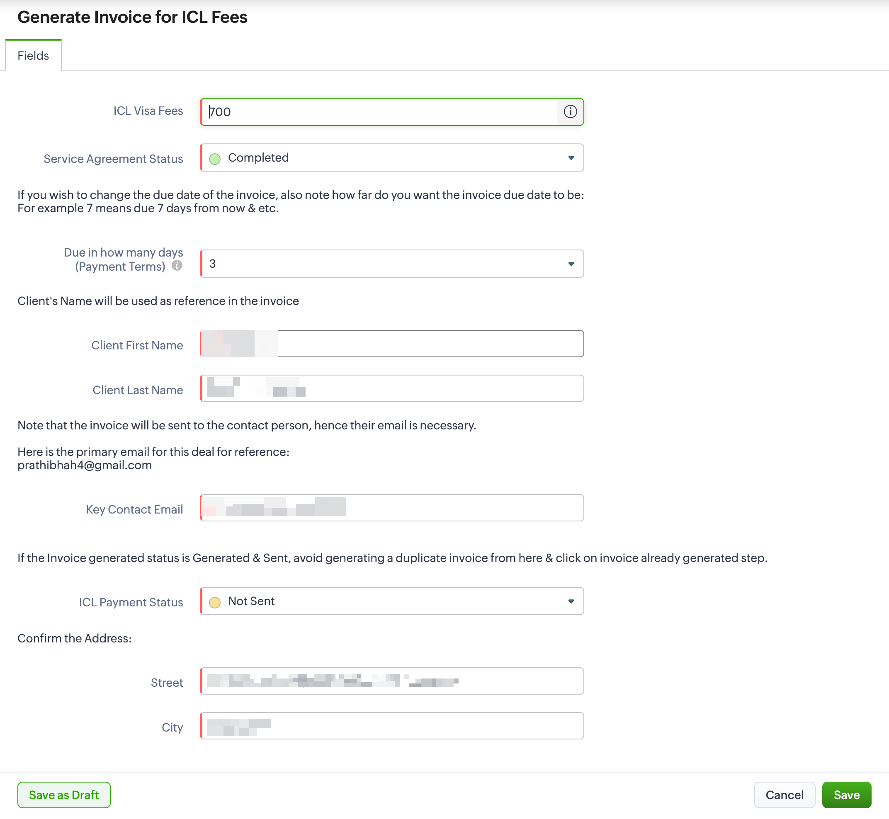
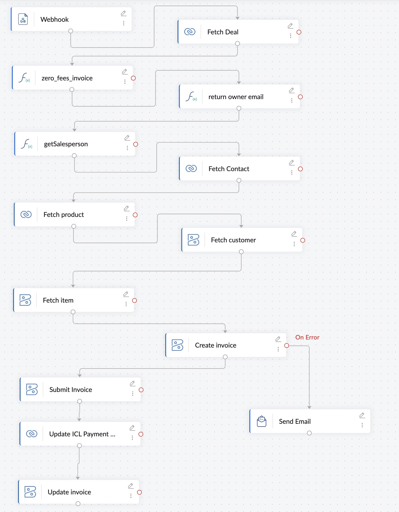

> **Complexity:** ⭐⭐⭐⭐☆ Advanced
>
> **Category:** CRM Integration
>
> **Business Domain:** Finance / Invoicing
>
> **Platform:** Zoho Flow
>
> **Technologies:** Zoho CRM, Zoho Books, Deluge, Webhooks

# Zoho CRM → Zoho Books Invoice Automation

Automatically generates, submits, and synchronizes invoices between Zoho
CRM and Zoho Books when an adviser initiates the **Generate Invoice for
ICL Fees** Blueprint transition in Zoho CRM.

------------------------------------------------------------------------

# Overview

This automation connects **Zoho CRM**, **Zoho Flow**, and **Zoho Books**
to completely automate invoice generation.

The process begins in **Zoho CRM** after a Deal reaches the **Service
Agreement Signed** Blueprint state. An adviser starts the **Generate
Invoice for ICL Fees** transition, reviews the invoice details, and
submits the Blueprint form. The Blueprint then invokes a webhook that
starts Zoho Flow.

Zoho Flow retrieves all required CRM and Zoho Books records, validates
business rules, determines the correct salesperson, creates and submits
the invoice, synchronizes invoice information back to Zoho CRM, and
notifies the administrator if any errors occur.

The result is a consistent, end-to-end invoice generation process with
minimal manual work.

------------------------------------------------------------------------

# Business Problem

Before this automation, advisers had to:

-   Open the Deal in Zoho CRM
-   Create the invoice manually in Zoho Books
-   Assign the correct salesperson
-   Submit the invoice
-   Copy invoice details back into CRM
-   Resolve synchronization issues manually

This process was repetitive, time-consuming, and prone to human error.

------------------------------------------------------------------------

# Solution

1.  Deal reaches **Service Agreement Signed**.
2.  Adviser selects **Generate Invoice for ICL Fees**.
3.  Adviser confirms invoice details.
4.  Zoho CRM Blueprint triggers a webhook.
5.  Zoho Flow retrieves CRM and Zoho Books data.
6.  Validation rules are executed.
7.  Salesperson is identified.
8.  Invoice is created.
9.  Invoice is submitted.
10. CRM is updated.
11. Administrator is notified if an error occurs.

------------------------------------------------------------------------

# Repository Files

  --------------------------------------------------------------------------
  File                            Purpose
  ------------------------------- ------------------------------------------
  README.md                       Documentation

  invoice-flow.jpg                Zoho Flow workflow

  assets/zoho-crm-blueprint.png   Blueprint transition that starts the
                                  automation

  assets/invoice-form.png         Invoice confirmation form
  --------------------------------------------------------------------------

------------------------------------------------------------------------

# Zoho CRM Context

## Step 1 --- Blueprint Transition

Once the Deal reaches **Service Agreement Signed**, the adviser starts
the **Generate Invoice for ICL Fees** Blueprint transition.



------------------------------------------------------------------------

## Step 2 --- Confirm Invoice Details

The adviser reviews invoice information before continuing.

Typical fields include:

-   ICL Visa Fees
-   Service Agreement Status
-   Payment Terms
-   Client Name
-   Contact Email
-   Payment Status
-   Billing Address



------------------------------------------------------------------------

## Step 3 --- Blueprint Starts Zoho Flow

Submitting the form invokes a Blueprint webhook which sends the Deal ID
to Zoho Flow.

------------------------------------------------------------------------

# Workflow



------------------------------------------------------------------------

# Trigger

The automation starts when the adviser submits the **Generate Invoice
for ICL Fees** Blueprint form. The Blueprint sends a webhook containing
the Deal ID to Zoho Flow.

------------------------------------------------------------------------

# Data Flow

``` text
Adviser
    │
    ▼
Zoho CRM Deal
    │
    ▼
Service Agreement Signed
    │
    ▼
Generate Invoice for ICL Fees
    │
    ▼
Invoice Confirmation Form
    │
    ▼
Blueprint Webhook
    │
    ▼
Zoho Flow
    │
    ├── Fetch Deal
    ├── Validate Invoice
    ├── Find Salesperson
    ├── Fetch Contact
    ├── Fetch Product
    ├── Fetch Customer
    ├── Fetch Item
    │
    ▼
Create Invoice
    │
┌───┴────────┐
│            │
▼            ▼
Success    Failure
│            │
▼            ▼
Submit     Email Admin
Invoice
│
▼
Update CRM
```

------------------------------------------------------------------------

# Detailed Logic

1.  Receive webhook.
2.  Fetch Deal.
3.  Execute `zero_fees_invoice`.
4.  Find Zoho Books salesperson using Deal owner email.
5.  Fetch Contact, Product, Customer and Item.
6.  Create Invoice.
7.  Submit Invoice.
8.  Update CRM with invoice metadata.
9.  Notify administrator if any failures occur.

------------------------------------------------------------------------

# Components Used

  Component                   Purpose
  --------------------------- -------------------------------------
  Blueprint Transition        Starts invoice generation
  Invoice Confirmation Form   Validates invoice details
  Webhook                     Starts Zoho Flow
  zero_fees_invoice           Handles zero-fee invoices
  getSalesperson              Maps CRM owner to Books salesperson
  Create Invoice              Generates invoice
  Submit Invoice              Finalizes invoice
  Update CRM Record           Synchronizes invoice information
  Send Email                  Error notification

------------------------------------------------------------------------

# Example Scenario

### Before

-   Deal is **Service Agreement Signed**
-   Adviser starts **Generate Invoice for ICL Fees**
-   Invoice has not been created

↓

### After

-   Blueprint webhook starts Zoho Flow
-   Invoice created
-   Invoice submitted
-   CRM updated
-   Administrator notified if required

------------------------------------------------------------------------

# Technical Notes

-   Event-driven architecture.
-   Triggered from a Zoho CRM Blueprint transition.
-   Uses Zoho Flow for orchestration.
-   Uses Deluge custom functions for business logic.
-   Synchronizes Zoho CRM and Zoho Books.

------------------------------------------------------------------------

# Future Improvements

-   Retry failed executions
-   Duplicate invoice detection
-   Improved logging
-   Teams/Slack notifications
-   Configurable notification recipients
